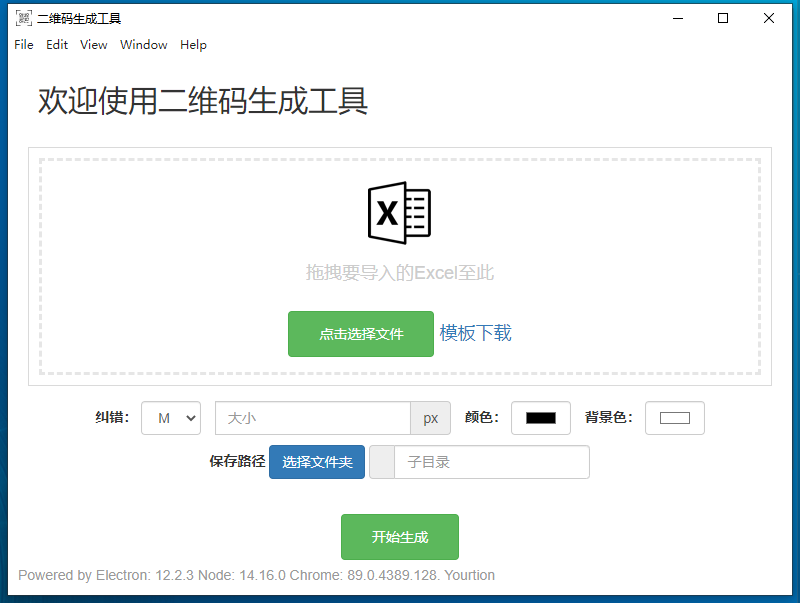
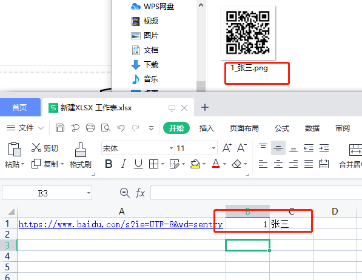

# Electron-BatchCreateQRCode

二维码批量生成工具

下载地址：https://github.com/Houtx/Electron-BatchCreateQRCode/releases

目前我只打了一个win版的安装包。

## 说明

生成二维码的 Excel 文件中第一个表格

    第一列为二维码内容，会判断是不是 url(是否包含http)，如果不是 url 会跳过。

    第二列为id，第三列为文件名称。(当第二列和第三列为空时，文件名称自动生成。)
    

生成示例:

